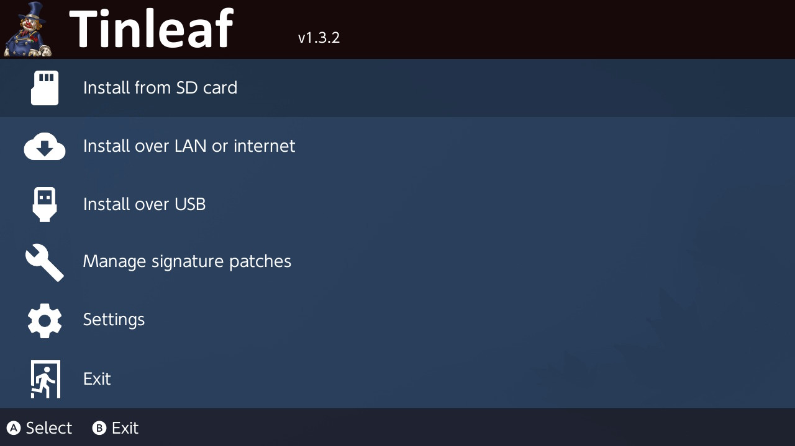

# Tinleaf
A No-Bullshit-No-Bullshit NSP, NSZ, XCI, and XCZ Installer for Nintendo Switch

## Features
- Installs NSP/NSZ/XCI/XCZ files and split NSP/XCI files from your SD card
- Installs NSP/NSZ/XCI/XCZ files over LAN or USB from tools such as [NS-USBloader](https://github.com/developersu/ns-usbloader)
- Installs NSP/NSZ/XCI/XCZ files over the internet by URL or Google Drive
- Verifies NCAs by header signature before they're installed
- Installs and manages the latest signature patches quickly and easily
- Works on SX OS and Atmosphere

## Thanks to
- Adubbz
- Goffrier
- Blawar
- Xortroll

## Prominently Modified
This code was prominently modified by blawar on 2020-03-12
